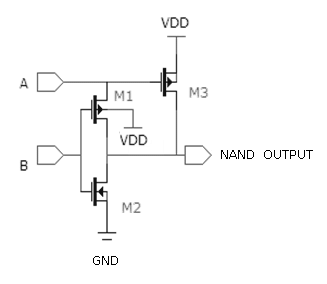
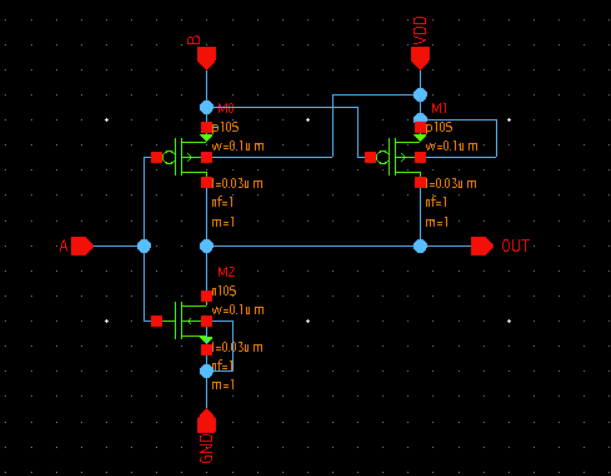
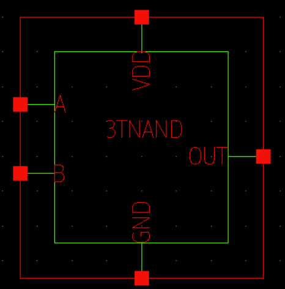
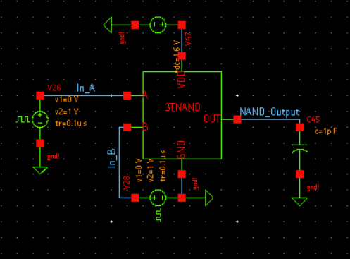
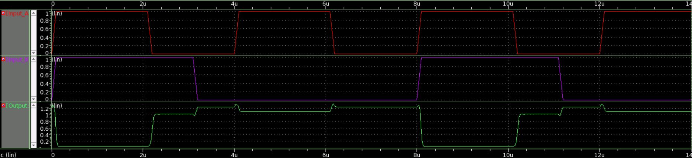

# Low-Power 3T NAND for SoC Apps
This repository presents the design of three-transistor(3T) NAND Gate implemented using Synopsis Custom Compiler on 28nm Hybrid CMOS Technology.

## Table of Contents
- [Introduction](#introduction)  
- [3T NAND](#3t-nand)  
- [Tools Used](#tools-used)  
- [Pre-Layout Schematics and Simulations](#pre-layout-schematics-and-simulations)  
- [Netlist of the Circuit](#netlist-of-the-circuit)  
- [Author](#author)  
- [Acknowledgements](#acknowledgements)  
- [References](#references)  

## Introduction  
Energy efficiency is one of the most sought features for modern electronic systems designed for high-performance and portable applications. NAND Gate is the most preferred universal gate since it occupies less area and offers minor delay than NOR when designed with CMOS Technology and is used numerous times in other gates and integrated circuits. This paper proposes the design of three transistor-based NAND gates with the same output logic as the primary CMOS NAND Gate. 
The proposed method will demonstrate better performance in low-power consumption, reduced area, and higher speeds, the characteristics most sought after in VLSI circuits for low-power System-on-Chip (SoC) applications.

## 3T NAND  
The basic NAND using CMOS only is 4T CMOS. The proposed design of three transistor NAND is based on modified CMOS inverter and PMOS pass-transistor logic. The reference circuit will be implemented in 28nm technology.

  

<h4 align="center">Fig. 1 - 3T NAND</h4> &nbsp;&nbsp;

When input A is at logic one, the inverter on the
left (M1 and M3) functions as a normal CMOS inverter.
Therefore, the output is the complement of input B. When
the input A is at logic zero, the CMOS inverter output is
at high impedance. However, the PMOS pass-transistor
M2 is turned ON and the output gets the logic value as
logic 1 (VDD). The operation of the whole circuit could
be explained like a 2 input NAND gate.

## Tools Used  
• Synopsys Custom Compiler:    
The Synopsys Custom Compiler™ design environment is a modern solution for full-custom analog, custom digital, and mixed-signal IC design. As the heart of the Synopsys Custom Design Platform, Custom Compiler provides design entry, simulation management and analysis, and custom layout editing features. This tool was used to design the circuit on a transistor level.

• Synopsys Primewave:  
PrimeWave™ Design Environment is a comprehensive and flexible environment for simulation setup and analysis of analog, RF, mixed-signal design, custom-digital and memory designs within the Synopsys Custom Design Platform. This tool helped in various types of simulations of the above designed circuit.

• Synopsys 28nm PDK:  
The Synopsys 28nm Process Design Kit(PDK) was used in creation and simulation of the above designed circuit.

## Pre-Layout Schematics and Simulations  
### Schematic:

  

<h4 align="center">Fig. 2 - 3T NAND Schematic</h4> &nbsp;&nbsp;  

  

<h4 align="center">Fig. 3 - 3T NAND Symbol</h4> &nbsp;&nbsp;

  

<h4 align="center">Fig. 4 - 3T NAND Testbench</h4> &nbsp;&nbsp;

### Simulation:  
#### Transient Analysis:  

  

<h4 align="center">Fig. 5 - Input-Output Waveform of 3TNAND Testbench @ VDD = 1.6V</h4>  

## Netlist of the Circuit  
Refer to the netlist of the NAND Gate simulation [here](src/3tnand-schematic-netlist.sp)  

## Author  
[L N Saaswath](https://www.linkedin.com/in/lnsaaswath/), Junior Undergraduate @ Department of Electrical Engineering, IIT(BHU) Varanasi.

## Acknowledgements  
• [Cloud Based Analog IC Design Hackathon](https://hackathoniith.in/)  
• [Synopsys India](https://www.synopsys.com/)  
• [VLSI System Design (VSD) Corp. Pvt. Ltd India](https://www.vlsisystemdesign.com/)
• Sumanto Kar, IIT B

## References
[1] Chandrakasan A.P. Sheng S. Brodersen R.W.: "Low-power CMOS digital design", IEEE Journal of Solid-State Circuits, Volume 27, Issue 4, April 1992 pp. 473 -- 484.  
[2] Verma N. Kwong J. Chandrakasan A.P.: "Nanometer MOSFET Variation in Minimum Energy Subthreshold Circuits", IEEE Transactions on Electron Devices, Vol. 55, NO. 1, January 2008, pp. 163 -- 174.  
[3] Y. Berg, D. T. Wisland and T. S. Lande: "Ultra LowVoltage/Low-Power Digital Floating-Gate Circuits", IEEE Transactions on Circuits and Systems, vol. 46, No. 7, pp. 930– 936, July 1999.  
[4] Priya, M.  Kaliaperumal, Baskaran. (2013). A Novel Low Power 3 Transistor based Universal Gate for VLSI Applications. Journal of scientific and industrial research. 72. pp. 217-221.   
